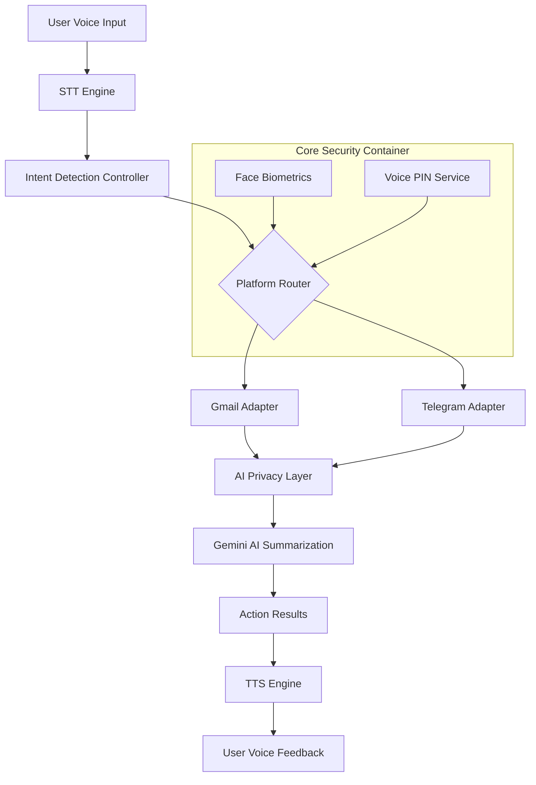

<div align="center">

# 🎙️ Govind: AI Voice-First Communication Assistant

**The most secure, private, and accessible voice assistant for Email & Messaging.**

[](https://vitejs.dev/)
[](https://reactjs.org/)
[](https://www.typescriptlang.org/)
[](https://firebase.google.com/)
[](https://tailwindcss.com/)
[](https://ai.google.dev/)

[Explore Docs](./DOCUMENTATION.md) · [Report Bug](https://github.com/jenaarmaan/Team-D-Infosys-Springboard-Internship-6.0-Batch--11/issues) · [Request Feature](https://github.com/jenaarmaan/Team-D-Infosys-Springboard-Internship-6.0-Batch--11/issues)

</div>

---

## 🌊 Overview

**Govind** (Voice-Based Email Messaging Assistant) is a cutting-edge, voice-first platform designed to make digital communication seamless, secure, and accessible. Whether you're managing complex email threads or staying in touch via Telegram, Govind acts as your intelligent intermediary, processing commands through high-fidelity voice recognition and advanced AI summarization.

Built with a **Privacy-First** ethos, Govind ensures your sensitive data never leaves your control without explicit sanitization, setting a new standard for AI assistants.

---

## ✨ Key Features

### 🎙️ Voice-First Interaction
- **Seamless Speech-to-Text**: High-accuracy voice command recognition.
- **Natural Text-to-Speech**: Listen to your summaries and messages in a natural-sounding voice.
- **Intent Detection**: Advanced NLP to understand complex commands like "Read Telegram from John and reply saying I'll be late."

### 🔐 Unrivaled Security & Privacy
- **Biometric Authentication**: Secure login using Face Mesh and Face Landmarks detection (TensorFlow.js).
- **Voice PIN**: Two-factor authentication for sensitive actions.
- **AI Privacy Layer**: Hard boundary sanitization that masks sensitive PII before it reaches AI models.
- **Federated Edge Processing**: Privacy-preserving AI that keeps sensitive data local.

### ✉️ Multi-Platform Integration
- **Gmail**: Complete email management (Read, Send, Summarize, Draft).
- **Telegram**: Real-time messaging using a custom Telethon-based client.
- **Unified Interface**: One voice to rule all your accounts.

---

## 🛠️ Tech Stack

| Category | Technology |
| :--- | :--- |
| **Frontend** | React 18, Vite, TypeScript, Tailwind CSS, Shadcn UI |
| **State/Data** | TanStack Query, Zod, Firebase Hooks |
| **AI/ML** | Google Gemini 2.0 Flash, TensorFlow.js (Face Landmarks), MediaPipe |
| **Backend** | Firebase (Auth, Firestore, Hosting), Vercel Serverless Functions |
| **Messaging** | Custom Bot API Wrapper (Telegram) |
| **Testing** | Vitest, Testing Library |

---

## 🏗️ Architecture



---

## 🚀 Getting Started

### Prerequisites

- Node.js (v18+)
- npm / yarn
- Firebase Project
- API Keys for: Gemini, Telegram

### Quick Start

1. **Clone the repository**
   ```bash
   git clone https://github.com/jenaarmaan/Team-D-Infosys-Springboard-Internship-6.0-Batch--11.git
   cd voice-mail
   ```

2. **Install dependencies**
   ```bash
   npm install
   ```

3. **Configure Environment Variables**
   Create a `.env` file in the root directory:
   ```env
   VITE_FIREBASE_API_KEY=...
   VITE_GEMINI_API_KEY=...
   VITE_TELEGRAM_BOT_TOKEN=...
   ```

4. **Launch Development Server**
   ```bash
   npm run dev
   ```

---

## 🔐 Security & Privacy Implementation

Govind doesn't just promise privacy; it enforces it.

### The Gemini Hard Boundary
Our Gemini adapter includes a built-in security middleware. Before a prompt is sent to the cloud:
1. `detectSensitiveData(prompt)` scans for PII, OTPs, and sensitive entities.
2. `sanitize(prompt)` masks detected data.
3. If raw sensitive data attempt to bypass sanitization, the system **throws a hard error**, killing the request before it leaves your machine.

---

## 📅 Roadmap & Milestones

### ✅ Milestone 1: Setup & Authentication
**Deliverable:** Functional login + speech-to-text prototype
- **User Registration/Login**: OAuth2 (Google/Microsoft) via Firebase.
- **Biometric Security**: Face recognition using TensorFlow.js & MediaPipe.
- **Voice PIN**: Secure 2FA for sensitive operations.
- **Profile Management**: Voice-guided setup for language and preferences.

### ✅ Milestone 2: Core Speech & Email Integration
**Deliverable:** Voice-controlled Gmail assistant (MVP)
- **Speech Pipeline**: Continuous recognition (Web Speech API) + custom TTS.
- **Gmail Integration**: Full email lifecycle (Read, Send, Reply, Delete).
- **Voice State Machine**: Advanced wake-word and interruption handling.
- **Intent Engine**: NLU-based command classification.

### ✅ Milestone 3: Messaging, Summarization & AI Replies
**Deliverable:** Multi-platform assistant with smart AI capabilities
- **Multi-Platform Messaging**: Telegram (Custom Bot API).
- **Smart Summarization**: Gemini-powered email/message condensing.
- **AI Reply Suggestions**: Context-aware drafting and composition.
- **Multi-Language Support**: Seamless switching between voice recognition languages.

---

## 🎯 Feature Matrix

| Feature | Registration | Email (Gmail) | Messaging (Telegram) | Security | Status |
| :--- | :---: | :---: | :---: | :---: | :--- |
| **Voice Navigation** | ✅ | ✅ | ✅ | ✅ | **Complete** |
| **Biometric Login** | ✅ | - | - | ✅ | **Complete** |
| **Summarization** | - | ✅ | ✅ | - | **Complete** |
| **Smart Replies** | - | ✅ | ✅ | - | **Complete** |
| **Privacy Masking** | ✅ | ✅ | ✅ | ✅ | **Complete** |

---

## 🗣️ Common Voice Commands

| Action | Command Example |
| :--- | :--- |
| **Management** | "Open Gmail", "Go to Telegram" |
| **Reading** | "Read my emails", "Read Telegram from John" |
| **Interaction** | "Reply saying I'm busy", "Summarize this thread" |
| **Composition** | "Draft a new email", "Compose a message on Telegram" |

---

## 🧪 Testing

We value stability. Our test suite includes unit, integration, and platform-specific tests.

```bash
npm run test          # Run all tests
npm run test:watch    # Watch mode for development
```

---

## 🤝 Contributing

Contributions are what make the open-source community such an amazing place to learn, inspire, and create. Any contributions you make are **greatly appreciated**.

1. Fork the Project
2. Create your Feature Branch (`git checkout -b feature/AmazingFeature`)
3. Commit your Changes (`git commit -m 'Add some AmazingFeature'`)
4. Push to the Branch (`git push origin feature/AmazingFeature`)
5. Open a Pull Request

---

## 📜 License

Distributed under the MIT License. See `LICENSE` for more information.

---

## 📧 Contact

**Team D - Infosys Springboard Internship 6.0 (Batch 11)**

<div align="center">

Made with ❤️ by Team D

[Back to top](#-govind-ai-voice-first-communication-assistant)

</div>
